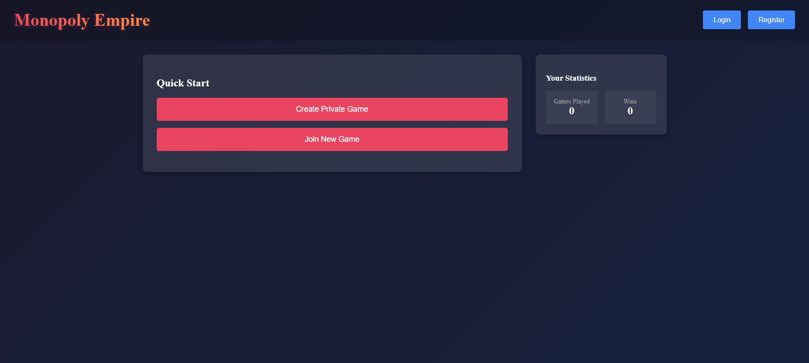
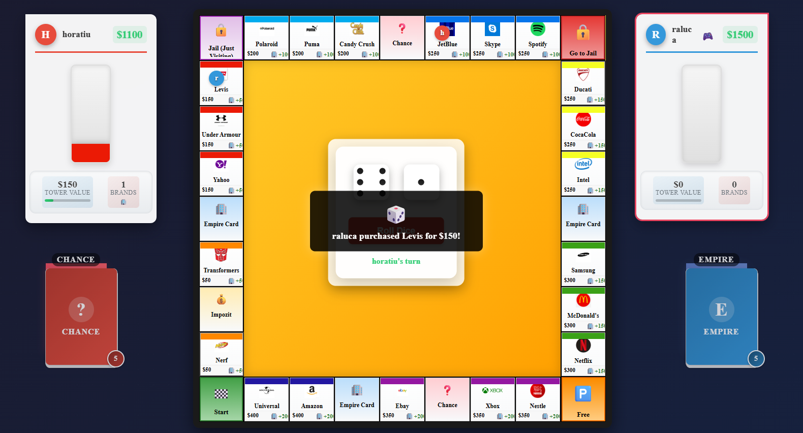
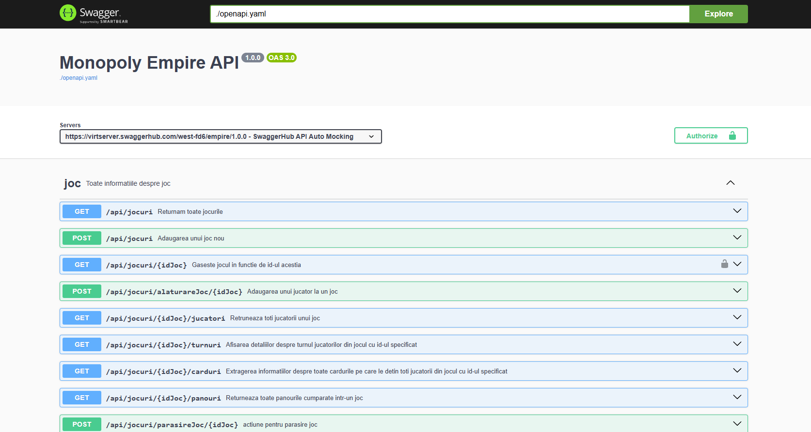

# Monopoly Empire Game

We developed this project for the “Web Programming” course at our university as a team of three students. In this assignment, we applied REST API principles, OpenAPI specifications, and modern web development techniques to create a multiplayer board game inspired by Monopoly Empire.

We implemented gameplay that allows players to roll dice, move around the board, and purchase properties. Our objective was to accumulate tower value: the first player whose total tower value reaches 800 wins. If a player cannot afford a required payment, they go bankrupt and exit the game, and we continue until only one player remains, who is then declared the winner.

## Screenshots

On the home screen, we provide an overview of the application and options to start or join a game:


During gameplay, our interface displays available properties and each player's position on the board:


We integrated Swagger UI for API documentation, where all endpoints are listed and described:


## Technology Stack

On the backend, we used Java with Spring Boot, and on the frontend, we chose React with Vite. We configured a PostgreSQL database on Neon Cloud, connected via Spring Data abstractions so we can switch to any JDBC-compatible database easily. We also used OpenAPI specifications to automatically generate API documentation.

## Containerization

Each service runs in its own Docker container with all necessary dependencies installed. For backend API testing, we implemented tests using the Karate framework, which allowed us to define and run tests concisely.

## Real-Time Notifications

To deliver real-time game events—such as player moves, property purchases, and victories—we implemented Server-Sent Events (SSE) in Spring Boot, broadcasting updates to all connected clients.

## Setup and Running

To run the project, first ensure that Docker and Docker Compose are installed. In the project root, we copy `.env.example` to `.env` and fill in the required environment variables. Then we execute:

```bash
docker-compose up --build
```

After the containers are up, the frontend is available at `http://localhost:3000`, and the backend API along with Swagger UI can be accessed at `http://localhost:8081`.

## Environment Variables

In the `.env` file, we define variables such as `DB_URL`, `DB_USER`, `DB_PASSWORD`, `SPRING_PROFILES_ACTIVE`, `FRONTEND_PORT`, and `BACKEND_PORT`, as detailed in `.env.example`.

## Testing

To run our API test suite with Maven, we use:

```bash
mvn test -Dkarate.options="--tags @api"
```

## Contributing

We welcome contributions! Please fork the repository and submit pull requests. Make sure all tests pass and follow our coding style guidelines before submitting changes.

## License

This project is released under the MIT License.
